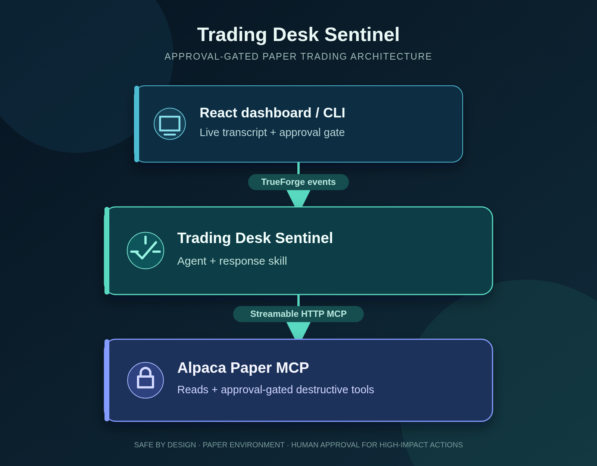

<div align="center">

# Trading Desk Sentinel

### A human-approved incident responder for paper-trading operations

Investigate an account anomaly, trace it to the relevant activity, and keep every consequential action behind an explicit approval gate.

[](https://github.com/siddarth709/trading-desk-sentinel/actions/workflows/ci.yml)
[](https://www.typescriptlang.org/)
[](https://modelcontextprotocol.io/)
[](LICENSE)

> **Developer draft** — built as a hackathon prototype. It is intentionally designed for Alpaca **paper** accounts only and is not investment advice.

</div>

---

## Why this exists

An automated trading alert should lead to an explanation before it leads to an action. Trading Desk Sentinel turns an alert such as “equity dropped sharply during the last session” into a structured investigation:

1. Read the account and portfolio history.
2. Correlate the affected window with positions and orders.
3. State a plain-language root cause.
4. Propose an action only when the evidence supports it.
5. Pause for a person before running a destructive tool.

The approval boundary is part of the tool metadata and agent policy—not an instruction the model can simply ignore.

## What is in the repository



| Directory | Role |
| --- | --- |
| `mcp-server/` | Streamable HTTP MCP server for the Alpaca Paper API. |
| `agent/` | TrueForge agent manifest and tool-approval policy. |
| `skills/` | Git-backed incident-response playbook used by the agent. |
| `client/` | CLI runner plus registration script for a TrueForge instance. |
| `ui/` | React/Vite dashboard with streamed events and approval controls. |
| `mock-server/` | Lightweight TrueForge-compatible mock for UI development. |

## Tool surface and safety contract

The MCP service listens on `http://127.0.0.1:8791/mcp` by default.

| Tool | Access | Purpose |
| --- | --- | --- |
| `get_account` | Read-only | Account equity and buying-power context. |
| `get_portfolio_history` | Read-only | Locate the start and shape of an anomaly. |
| `get_positions` | Read-only | Inspect current exposure and P&L. |
| `get_recent_orders` | Read-only | Correlate an event with recent fills and order state. |
| `flatten_position` | Approval required | Close one named paper position at market. |
| `disable_strategy` | Approval required | Record a kill-switch entry for a named symbol, readable via `GET /strategy-state`. |

`flatten_position` and `disable_strategy` have `destructiveHint: true`. The agent manifest requests approval for all destructive tools, and both the CLI and dashboard wait for the corresponding `tool.approval_required` event. No order is submitted before a user allows it.

## Quick start

### Prerequisites

- Node.js 22 or later (required by the TrueForge SDK)
- An Alpaca **paper-trading** API key and secret
- A running TrueForge instance for live agent workflows

```bash
# Clone and install all npm workspaces.
git clone https://github.com/siddarth709/trading-desk-sentinel.git
cd trading-desk-sentinel
npm install

# Terminal 1 — launch the MCP server against Alpaca Paper.
ALPACA_API_KEY="your-paper-key" \
ALPACA_SECRET_KEY="your-paper-secret" \
npm run dev --workspace mcp-server

# Terminal 2 — start TrueForge.
npx @truefoundry/trueforge

# Terminal 3 — register the connector, skill, and agent.
#
# LOCAL DEVELOPMENT:
TRUEFORGE_BASE_URL="http://127.0.0.1:8790" \
SENTINEL_MCP_URL="http://127.0.0.1:8791/mcp" \
SKILL_REPO_URL="https://github.com/siddarth709/trading-desk-sentinel" \
npm run register --workspace client

# DEPLOYED RENDER MCP:
#
# Replace YOUR-RENDER-SERVICE with the hostname of the deployed
# sentinel-alpaca-mcp Render service and paste the generated
# MCP_SHARED_SECRET from the Render service environment.
TRUEFORGE_BASE_URL="https://YOUR-TRUEFORGE-HOST" \
SENTINEL_MCP_URL="https://YOUR-RENDER-SERVICE.onrender.com/mcp" \
MCP_SHARED_SECRET="YOUR_RENDER_GENERATED_SECRET" \
SKILL_REPO_URL="https://github.com/siddarth709/trading-desk-sentinel" \
npm run register --workspace client
```

Connect a model provider in the TrueForge settings, then choose either interface:

```bash
# CLI investigation
ALERT="Paper-account equity dropped noticeably in the last session. Investigate and report the root cause." \
npm run start --workspace client

# Browser dashboard
VITE_TRUEFORGE_BASE_URL="http://127.0.0.1:8790" npm run dev --workspace ui
# Open the URL printed by Vite (normally http://127.0.0.1:5173).
```

### Deploying the dashboard to Render

The dashboard is deployed as a Node web service rather than a static site. A
static site cannot proxy the SDK's streaming requests, and a browser request
directly to a separately hosted TrueForge server can fail because of CORS.
`ui/server.mjs` serves the built dashboard and forwards `/truforge-api/*` to
TrueForge on the server side.

When using `render.yaml`, set `TRUEFORGE_BASE_URL` on the `sentinel-ui`
service to the public HTTPS URL of the TrueForge server, then redeploy. Do not
set `VITE_TRUEFORGE_BASE_URL` on the Render UI service; that would make the
browser bypass the same-origin proxy. The UI service must start with
`npm start --workspace ui`, as configured in the Blueprint.

### UI-only development

You can exercise the dashboard without Alpaca credentials or a TrueForge instance:

```bash
PORT=8792 node mock-server/server.mjs
VITE_TRUEFORGE_BASE_URL="http://127.0.0.1:8792" npm run dev --workspace ui
```

The standalone mock server is for manual development. The UI test uses its own inline mock so that its expected event shapes remain explicit and self-contained.

## Developer workflow

Run these checks before opening a pull request:

```bash
npm run lint
npm run typecheck
npm run build --workspace mcp-server
npm run test
npm run build
```

The CI workflow runs the same sequence on pull requests and pushes to `main`.

## Design notes

- **Paper only:** the Alpaca integration is pinned to the paper endpoint; non-paper `ALPACA_BASE_URL` overrides are rejected at runtime.
- **Evidence first:** the agent playbook calls for account state, history, positions, and orders before it proposes an intervention.
- **Approval is structural:** destructive annotations and the TrueForge policy enforce the pause; it is not reliant on prompt wording.
- **Least surprise:** when the investigation is inconclusive, the intended behavior is to report uncertainty and stop.
- **Secrets stay local:** provide credentials through environment variables. Do not commit `.env` files or the generated `strategy_state.json` kill-switch state.
 - **Kill-switch state is durable in deployment:** `disable_strategy` writes to a Postgres table (`sentinel-strategy-state` in `render.yaml`, wired in via `DATABASE_URL`) whenever `DATABASE_URL` is set, so a restart, redeploy, or free-plan spin-down can never silently undo a disable. Local `npm run dev` without `DATABASE_URL` falls back to the local `strategy_state.json` file — convenient for development, but that fallback must never be relied on in the Render deployment, since a free web service's filesystem is ephemeral. Note: Render's free Postgres plan expires after 30 days and has a 14-day upgrade grace period; recreate the database and update `DATABASE_URL` before deletion, or upgrade to a paid plan.
- **OAA integration reads over HTTP, not a local file:** the documented contract for the separately-built OAA pipeline is `GET /strategy-state` on this server (protected by `MCP_SHARED_SECRET` when it's set), not a local `strategy_state.json` on OAA's own filesystem. That endpoint proxies whichever backend `disable_strategy` is currently using (Postgres in deployment, the local file in dev), so a disable is always visible to OAA the same way. A patched OAA `main.py` that instead reads a local file will silently miss every disable recorded in Postgres — update it to poll `/strategy-state` before scanning a symbol.
- **Bound to loopback by default:** the MCP service listens on `127.0.0.1` unless `HOST` is set, matching the "Quick start" URL above. `MCP_SHARED_SECRET` is normally unset in local dev, so binding `0.0.0.0` by default would put an unauthenticated server — including the `/strategy-state` kill-switch reader — on the local network. `render.yaml` sets `HOST=0.0.0.0` for the deployed service, where `MCP_SHARED_SECRET` is always generated.
- **`/health` reflects the kill-switch store, not just process liveness:** it calls into whichever `StrategyStore` is active (a no-op for the local file, `SELECT 1` for Postgres) and returns `503` if that fails. Render polls this path to decide whether to route traffic and whether to restart the service, so a database outage that would silently break `disable_strategy` is surfaced instead of masked behind a `200`.

## Repository map

```bash
# MCP server
npm run dev --workspace mcp-server
npm run build --workspace mcp-server

# CLI and TrueForge registration
npm run dev --workspace client
npm run register --workspace client

# Dashboard
npm run dev --workspace ui
npm run test --workspace ui
```

## Contributing

Keep changes focused, type-safe, and verified. The complete local setup and verification expectations are in [CONTRIBUTING.md](CONTRIBUTING.md). In particular, test changes to MCP annotations or event handling against the actual installed SDK interfaces rather than relying on remembered protocol shapes.

## Qodo review and fixes

Qodo is used as an automated reviewer for substantive pull requests. Its findings are treated as concrete engineering work: verify the reported behavior in the repository, make the smallest safe correction, and add regression coverage when a safety or correctness invariant is involved.

### What Qodo helped improve

| Finding | Resolution |
| --- | --- |
| The documented CI sequence did not match the workflow's build order. | The workflow now builds `mcp-server` before the tests that start its compiled server, and `CONTRIBUTING.md` documents that same sequence. |
| A non-paper `ALPACA_BASE_URL` could bypass the paper-only claim. | `mcp-server/src/alpaca.ts` now accepts only the exact Alpaca Paper endpoint and rejects other overrides before a request is sent. A unit test covers the rejection. |
| The UI-only setup started the mock service on a different port than the dashboard used. | The README explicitly starts the mock server on port `8792` and points the dashboard at it. |
| The live dashboard example did not point at the live TrueForge instance. | The live quick start now passes `VITE_TRUEFORGE_BASE_URL=http://127.0.0.1:8790`. |

This review loop is especially valuable here because the project has two hard boundaries worth protecting: paper-trading-only access and explicit human approval for destructive tools.

## Hackathon context

Trading Desk Sentinel was built for the Agent Harness Hackathon (WeMakeDevs × TrueFoundry × Qodo). The project focuses on a verifiable approval workflow, a Git-backed incident-response skill, a live event-driven UI, and automated review as part of its development process.

## Disclaimer

This is an experimental developer project for paper-trading incident response. It does not provide financial advice, and it should not be used to operate a live trading account.
